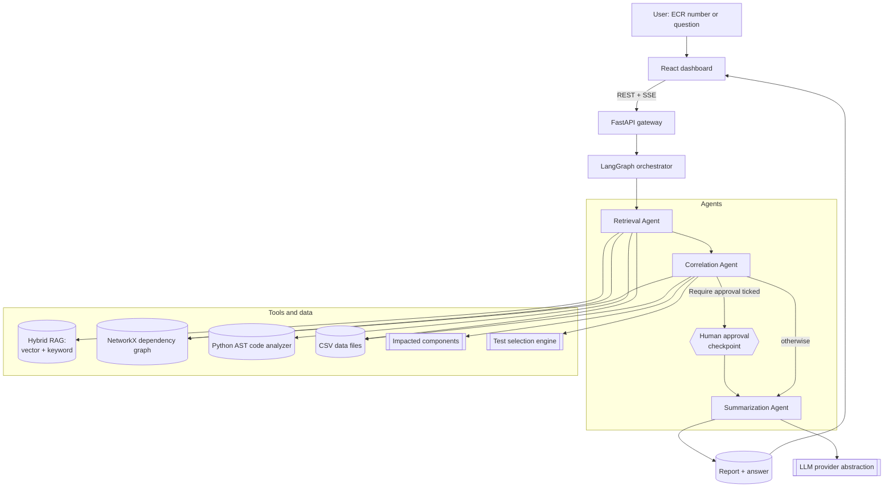
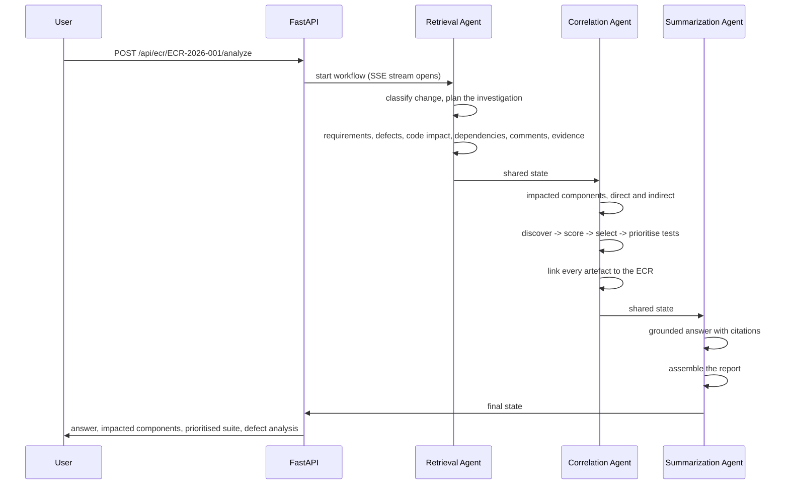

# ECR Intelligence Agent

**AI-Powered Engineering Change Request Assistant, Impact Analysis and Targeted Regression Test Selection**

> Understand the change. Predict the impact. Test what matters.

Give the platform an **ECR number**. Three agents retrieve everything that exists
about that change across systems, correlate it into one traceable picture, and
answer in plain language - with the regression tests that actually matter and the
reason each one was chosen.

---

## 1. Problem statement

When an Engineering Change Request lands, an engineer or QA lead currently:

1. reads the ECR,
2. hunts down the affected requirements,
3. searches historical defects for "have we broken this before?",
4. works out which applications and modules are impacted,
5. traces dependencies by tribal knowledge,
6. reads through comment threads and evidence attachments in several systems,
7. guesses the regression scope,
8. and then runs a very large regression suite anyway.

That is slow, tribal, error-prone and expensive - and the answer is rarely written
down anywhere afterwards.

## 2. What this platform does

```
ECR number  ->  Retrieval  ->  Correlation  ->  Summarization  ->  Answer + report
```

| Stage | What happens |
|---|---|
| **Retrieval** | Classifies the change, then pulls the ECR record, traced *and* semantically matched requirements, similar historical defects, AST-derived code impact, dependency-graph reach, review comments and evidence artefacts. |
| **Correlation** | Links every artefact to the ECR with a typed, explained edge; works out which components the change touches, directly and through dependencies; discovers, scores, filters and orders candidate regression tests. |
| **Summarization** | Answers the user's question from the correlated bundle **with citations**, and publishes the full ECR Intelligence Report (JSON / Markdown / HTML). |

Everything is explainable: every requirement match, every defect match, every
selected test and every impacted component carries the reason it is there.

## 3. Solution architecture



### The three agents



**Why three agents and not ten?** The three map onto the three things a human
actually does - *find it, join it up, explain it*. Inside them, five
**steps** still run independently, emit their own progress events and degrade
independently, so the workflow view stays fine-grained without a sprawling graph.

### Agentic properties

| Requirement | How it is met |
|---|---|
| Autonomous planning | The planning step reads the classified change and decides which optional steps run (`build_plan`). A profile-page copy tweak skips dependency and defect analysis; a schema migration runs everything. |
| Tool calling | Every capability is a registered tool (`GET /api/agents/tools`); each run records which tools it used. |
| Shared state | One `ECRWorkflowState` TypedDict with reducers for the additive keys. |
| Conditional routing | A real LangGraph conditional edge on the approval gate. |
| Human in the loop | The workflow blocks at the checkpoint and resumes on `POST /api/ecr/{id}/approve`; rejecting or excluding tests rewrites the recommendation. |
| Confidence scoring | Every step returns a confidence; the report blends them and applies penalties for failures and missing evidence. |
| Graceful degradation | A failing non-critical step records the error, marks its evidence unavailable, lowers confidence and lets the workflow finish. |
| Explainability | Structured reasons on every match, impacted component and selected test, plus a full execution trace. |

## 4. Technology stack

| Layer | Choice |
|---|---|
| Backend | Python 3.12+, FastAPI, Uvicorn, Pydantic v2, SQLAlchemy 2.0, Alembic |
| Agents | LangGraph, LangChain-core |
| Data | CSV files in `backend/data` (one per table), loaded into a working SQL copy at startup |
| Vector search | Abstraction over in-memory numpy / pgvector / ChromaDB |
| Graph | NetworkX (interface kept Neo4j-ready) |
| Code analysis | Python `ast` (Java/C# analyzers stubbed behind the same interface) |
| LLM | Provider abstraction over OpenAI-compatible gateways, Anthropic, Azure OpenAI, and a fully offline mock |
| Frontend | React 19, React Router, Tailwind, shadcn/ui - plain text and tables, no charts or graphs |
| Infra | Docker, docker-compose (backend + frontend, optional redis) |

## 5. Installation

### Option A - Docker (everything)

```bash
cp .env.example .env      # optional: add an LLM key
docker compose up --build
```

* Frontend: http://localhost:3000
* Backend: http://localhost:8000
* Swagger: http://localhost:8000/docs

### Option B - local

```bash
# backend
python -m venv .venv
.venv/Scripts/python -m pip install -r backend/requirements.txt   # Linux/macOS: .venv/bin/python
cd backend && ../.venv/Scripts/python -m app.seed --index         # check the CSV data + build embeddings
../.venv/Scripts/python -m uvicorn app.main:app --reload --port 8000

# frontend (second terminal)
cd frontend && yarn install && yarn start
```

`make help` lists the same steps as targets.

## 6. Environment

Everything is optional - the platform runs fully offline in **demo mode**.

| Variable | Purpose |
|---|---|
| `DATA_DIR` | Folder with the CSV data files (default `backend/data`). |
| `LLM_PROVIDER` | `auto` (default), `openai`, `anthropic`, `azure_openai`, `mock`. |
| `LLM_NARRATION` | `false` (default): an analysis makes exactly three LLM requests, one per agent, so it takes seconds. `true` also rewords every step, about 7 more requests. |
| `OPENAI_API_KEY` / `OPENAI_BASE_URL` / `OPENAI_MODEL` | Works with any OpenAI-compatible endpoint, including an enterprise LLM gateway. |
| `OPENAI_FAST_MODEL` | Cheaper/faster model used for all three agent requests (and for narration when it is on). |
| `OPENAI_EMBEDDING_MODEL` / `EMBEDDING_DIM` | Remote embeddings; must agree with each other. |
| `VECTOR_STORE` | `memory` (default), `pgvector`, `chroma`. |
| `TEST_WEIGHT_*`, `TEST_SELECTION_THRESHOLD` | Tune the test selection without touching code. |
| `HUMAN_IN_THE_LOOP` | Approval policy (the UI's "Require approval" box sets it per run). |
| `API_KEY`, `CORS_ORIGINS`, `RATE_LIMIT_PER_MINUTE` | Security controls. |

### Data files

All data is in `backend/data/`, one CSV file per table: `ecrs.csv`,
`requirements.csv`, `test_cases.csv`, `test_executions.csv`, `defects.csv`,
`components.csv`, `dependencies.csv`, `comments.csv` and `evidence.csv`, plus
`impact_reports.csv`, `agent_runs.csv` and `feedback.csv`, which the app fills in
as analyses run (full report JSON goes to `data/reports/`). Open them in Excel or
any editor and restart the backend after editing; `python -m app.seed` checks they
load and points at the file, line and column of any bad value.

**Demo mode is a first-class path, not a stub.** All scoring, selection,
traversal, retrieval and correlation is deterministic Python; the LLM only writes
the prose around it. With no key configured you still get the full analysis, the
same numbers and a rule-based narrative. If a key is present but the endpoint is
unreachable, each agent falls back to its rule-based text and a circuit breaker
stops further attempts, instead of hanging.

## 7. API

| Method | Path | Purpose |
|---|---|---|
| GET | `/api/health`, `/api/health/data` | Liveness and honest subsystem status |
| GET/POST | `/api/ecr` | List/search, create |
| GET | `/api/ecr/{id}` | ECR details |
| GET | `/api/ecr/{id}/sources` | Raw multi-source view (comments, evidence, last analysis) |
| POST | `/api/ecr/{id}/analyze[?wait=true]` | Run the agents (async by default) |
| GET | `/api/ecr/{id}/analysis` | Complete analysis payload |
| GET | `/api/ecr/{id}/impact` | Impacted components, dependencies, code impact, defects |
| GET | `/api/ecr/{id}/tests[?priority=P0,P1]` | Recommended suite, ordered |
| GET | `/api/ecr/{id}/workflow` | Execution trace, events, graph topology |
| POST | `/api/ecr/{id}/approve` | Resume a paused workflow |
| GET | `/api/ecr/{id}/report?format=json\|markdown\|html` | Final report |
| POST | `/api/ecr/{id}/ask` | Follow-up question about this ECR |
| POST | `/api/chat/query` | Natural-language entry point (detects intent + ECR) |
| GET | `/api/workflows/{id}/stream` | **SSE** live agent progress |
| GET | `/api/agents`, `/api/agents/tools`, `/api/agents/runs` | Agent catalogue and telemetry |
| GET | `/api/dashboard/stats`, `/api/components/graph` | Dashboard aggregates, landscape graph |
| POST/GET | `/api/feedback` | Feedback loop |

Full interactive documentation at `/docs`.

## 8. Sample data

Two domains share one schema, which is the point - the platform is
domain-agnostic:

| | Commerce / payments | Rail (I-ETMS onboard) |
|---|---|---|
| Components | 15 | 10 |
| Dependencies | 28 | 14 |
| Requirements | 20 | 10 (`L2R367`-style "shall" statements with TBC parameters) |
| Defects | 30 | 8 |
| Test cases | 150 | 59 (with Folder / Optimization_Technique / Test_Type / Test_Technique / Retired / Scorable) |
| ECRs | 10 | 3 |

Plus 25 review comments, 16 evidence artefacts and 2,090 synthetic test
executions. A small **sample repository** (18 Python modules) is parsed with the
`ast` module so code impact analysis is real, not simulated.

## 9. Demo scenarios

| ECR | Change | Expected profile |
|---|---|---|
| `ECR-2026-001` | Multi-currency payment validation | High impact: payment validator + currency direct, refund/order/gateway/invoice downstream |
| `ECR-2026-002` | Profile page button text | Low impact, UI tests only, dependency analysis skipped |
| `ECR-2026-003` | Transaction schema change | Critical dependency analysis |
| `ECR-2026-004` | Step-up authentication | Security change |
| `ECR-2026-005` | Notification email template | Low impact |
| `ECR-2026-012` | Depart Test key availability (rail) | Stays inside the rail suite |

```bash
python scripts/demo.py             # all five, against a running backend
python scripts/demo.py --ecr ECR-2026-001
```

## 10. User journey

1. Open the dashboard, or go straight to **ECR Analysis**.
2. Type an ECR number (`ECR-2026-001`) and press **Analyze**.
3. Watch the three agents execute live - each internal step reports as it finishes.
4. Read the **Execution Trace**: each step, the agent that ran it, its status and time, and the total time.
5. Read the **ECR Summary** - AI summary, impacted components, recommended tests, past defects, open concerns - and copy it for Teams.
6. Expand the sections below it: ECR details, requirements, recommended test cases (each with its reason), impacted components with recommended actions, defect analysis, conflicts and gaps, review comments and evidence.
7. Export the report as HTML, Markdown, JSON or print to PDF.
8. Ask a follow-up: *"why was TC-1020 selected?"*, *"what did the team already decide?"*

## 11. Testing

```bash
cd backend && ../.venv/Scripts/python -m pytest -n 0 -q
```

85 tests covering the selection algorithm, graph traversal, the
AST analyzer, retrieval, the agent steps, planner routing, the three-agent guardrail, the full workflow and
every API endpoint. The suite forces the offline provider, so it never needs a
network or a key.

## 12. Documentation

| Document | Contents |
|---|---|
| [docs/architecture.md](docs/architecture.md) | System, agent, data and RAG architecture with diagrams |
| [docs/agent-design.md](docs/agent-design.md) | Each agent and step, its tools, its contract, its failure mode |
| [docs/api-documentation.md](docs/api-documentation.md) | Endpoint reference with examples |
| [docs/demo-guide.md](docs/demo-guide.md) | Scripted walkthrough and expected results |
| [docs/deployment-guide.md](docs/deployment-guide.md) | Local, Docker and production notes |

## 13. Screenshots

Placeholders - capture from a running instance:

| View | Path |
|---|---|
| Dashboard | `docs/images/dashboard.png` |
| Live agent execution | `docs/images/agents.png` |
| Impact analysis | `docs/images/impact.png` |
| Regression recommendation | `docs/images/tests.png` |
| Report | `docs/images/report.png` |

## 14. Future enhancements

* Real connectors behind the existing provider interfaces: Azure DevOps work items / repos / test plans, Jira, GitHub, ServiceNow, TestRail, Confluence.
* Java and C# analyzers behind `CodeAnalyzer` (the interface already exists).
* Neo4j behind `BaseDependencyGraph` for landscapes too large for in-process NetworkX.
* Learning from the feedback loop: re-weight the selection algorithm from recorded outcomes.
* Test-outcome ingestion so historical failure rates update themselves.
* LangSmith tracing behind the LLM provider abstraction.
* Compare two ECRs; regression-optimisation trends over releases.
