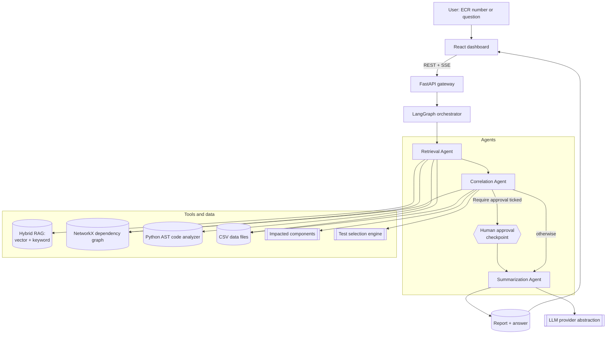

# ECR Intelligence Agent

**AI-Powered Engineering Change Request Assistant, Impact Analysis and Targeted Regression Test Selection**

> Understand the change. Predict the impact. Test what matters.

Give the platform an **ECR number**. Three agents retrieve everything that exists
about that change across systems, correlate it into one traceable picture, and
answer in plain language - with the regression tests that actually matter and the
reason each one was chosen.

---

## 1. Problem statement

When an Engineering Change Request lands, an engineer or QA lead currently:

1. reads the ECR,
2. hunts down the affected requirements,
3. searches historical defects for "have we broken this before?",
4. works out which applications and modules are impacted,
5. traces dependencies by tribal knowledge,
6. reads through comment threads and evidence attachments in several systems,
7. guesses the regression scope,
8. and then runs a very large regression suite anyway.

That is slow, tribal, error-prone and expensive - and the answer is rarely written
down anywhere afterwards.

## 2. What this platform does

```
ECR number  ->  Retrieval  ->  Correlation  ->  Summarization  ->  Answer + report
```

| Stage | What happens |
|---|---|
| **Retrieval** | Classifies the change, then pulls the ECR record, traced *and* semantically matched requirements, similar historical defects, AST-derived code impact, dependency-graph reach, review comments and evidence artifacts. |
| **Correlation** | Links every artifact to the ECR with a typed, explained edge; works out which components the change touches, directly and through dependencies; discovers, scores, filters and orders candidate regression tests. |
| **Summarization** | Answers the user's question from the correlated bundle **with citations**, and publishes the full ECR Intelligence Report (JSON / Markdown / HTML). |

Everything is explainable: every requirement match, every defect match, every
selected test and every impacted component carries the reason it is there.

## 3. Solution architecture



### The three agents


**Why three agents and not ten?** The three map onto the three things a human
actually does - *find it, join it up, explain it*. Inside them, five
**steps** still run independently, emit their own progress events and degrade
independently, so the workflow view stays fine-grained without a sprawling graph.

### Agentic properties

| Requirement | How it is met |
|---|---|
| Autonomous planning | The planning step reads the classified change and decides which optional steps run (`build_plan`). A profile-page copy tweak skips dependency and defect analysis; a schema migration runs everything. |
| Tool calling | Every capability is a registered tool (`GET /api/agents/tools`); each run records which tools it used. |
| Shared state | One `ECRWorkflowState` TypedDict with reducers for the additive keys. |
| Conditional routing | A real LangGraph conditional edge on the approval gate. |
| Human in the loop | The workflow blocks at the checkpoint and resumes on `POST /api/ecr/{id}/approve`; rejecting or excluding tests rewrites the recommendation. |
| Confidence scoring | Every step returns a confidence; the report blends them and applies penalties for failures and missing evidence. |
| Graceful degradation | A failing non-critical step records the error, marks its evidence unavailable, lowers confidence and lets the workflow finish. |
| Explainability | Structured reasons on every match, impacted component and selected test, plus a full execution trace. |

## 4. Technology stack

| Layer | Choice |
|---|---|
| Backend | Python 3.12+, FastAPI, Uvicorn, Pydantic v2, SQLAlchemy 2.0, Alembic |
| Agents | LangGraph, LangChain-core |
| Data | CSV files in `backend/data` (one per table), loaded into a working SQL copy at startup |
| Vector search | Abstraction over in-memory numpy / pgvector / ChromaDB |
| Graph | NetworkX (interface kept Neo4j-ready) |
| Code analysis | Python `ast` (Java/C# analyzers stubbed behind the same interface) |
| LLM | Provider abstraction over OpenAI-compatible gateways, Anthropic, Azure OpenAI, and a fully offline mock |
| Frontend | React 19, React Router, Tailwind, shadcn/ui - plain text and tables, no charts or graphs |
| Infra | Docker, docker-compose (backend + frontend, optional redis) |

## 5. Installation and running

The application has two parts that run side by side:

| Part | Folder | Runs on |
|---|---|---|
| Backend - FastAPI, the three agents, CSV data | `backend/` | http://localhost:8000 (API docs at `/docs`) |
| Frontend - React dashboard | `frontend/` | http://localhost:3000 |

The steps below are for **Windows with PowerShell**, run from the repository root
(`ecr_assistant_ui`). On Linux/macOS use `.venv/bin/python` wherever you see
`.\.venv\Scripts\python.exe`.

### Prerequisites

| Tool | Version | Check with |
|---|---|---|
| Python | 3.12 or newer (developed on 3.14) | `python --version` |
| Node.js + npm | Node 18 or newer (developed on Node 26 / npm 11) | `node --version`, `npm --version` |
| Git | any | `git --version` |
| Docker Desktop | optional, only for Option B | `docker --version` |

### Option A - run locally (the usual way)

**Step 1 - Create the Python environment and install the backend** (once)

```powershell
python -m venv .venv
.\.venv\Scripts\python.exe -m pip install --upgrade pip
.\.venv\Scripts\python.exe -m pip install -r backend\requirements.txt
```

**Step 2 - Configure the backend** (once)

```powershell
Copy-Item .env.example backend\.env
```

Open `backend\.env`. Leaving the LLM settings empty is fine: the app runs in
**demo mode** with the offline model and gives the same numbers (see section 6).
To use a real model, point it at the LLM gateway. On the company network,
`api.openai.com` is blocked by ZScaler, so use the Capgemini Generative Engine
gateway, which is OpenAI-compatible:

```ini
LLM_PROVIDER=openai
OPENAI_API_KEY=<your gateway key>
OPENAI_BASE_URL=https://openai.generative-eu.engine.capgemini.com/v1
OPENAI_MODEL=openai.gpt-5-mini
OPENAI_FAST_MODEL=anthropic.claude-haiku-4-5-20251001-v1:0
OPENAI_EMBEDDING_MODEL=amazon.titan-embed-text-v2:0
EMBEDDING_DIM=1024
VECTOR_STORE=memory
```

`backend\.env` is git-ignored. Never commit the key.

**Step 3 - Configure the frontend** (once)

Create `frontend\.env` with one line, which tells the dashboard where the API is:

```ini
REACT_APP_BACKEND_URL=http://localhost:8000
```

**Step 4 - Install the frontend** (once, and again when `package.json` changes)

```powershell
cd frontend
npm install --legacy-peer-deps
cd ..
```

`--legacy-peer-deps` is needed because some React 19 packages declare older peer
versions. Yarn also works (`yarn install`) if you have it.

**Step 5 - Check the data and build the search index** (first run, and after editing the CSVs)

```powershell
cd backend
..\.venv\Scripts\python.exe -m app.seed --index
cd ..
```

It prints the row count of every CSV in `backend\data`, or the file, line and
column of any bad value. `--index` builds the embedding cache; add `--force` to
re-embed every row. It never changes the CSV files.

**Step 6 - Start the backend** (terminal 1)

```powershell
cd backend
..\.venv\Scripts\python.exe -m uvicorn app.main:app --reload --port 8000
```

Wait for `Application startup complete`, then check http://localhost:8000/api/health.

**Step 7 - Start the frontend** (terminal 2)

```powershell
cd frontend
npm start
```

The browser opens at http://localhost:3000. The first compile takes a minute.

**Step 8 - Use it**

1. Open **ECR Analysis**, pick an ECR (for example `ECR-1` or `ECR-2`) and click **Analyze**.
2. Watch the three agents run, and approve the result if **Require approval** was ticked.
3. Open **Report** to read it, or download it as HTML, Markdown, JSON or PDF.

Stop either server with `Ctrl+C`. Next time, only steps 6 and 7 are needed.

#### Shortcuts for the same steps

* **VS Code:** *Run and Debug* > **Full stack (backend + frontend)** starts
  both servers (steps 6 and 7). *Terminal > Run Task* has the setup steps:
  *Setup: create venv + install backend*, *Setup: install frontend* and *Seed
  database + build search index*.
* **Git Bash / Linux / macOS:** `scripts/start.sh` does steps 1, 5, 6 and 7.
  `make help` lists every step as a target.

### Option B - Docker (everything in containers)

```powershell
Copy-Item .env.example .env      # optional: add the LLM settings from step 2
docker compose up --build
```

This gives the same URLs: frontend http://localhost:3000, backend
http://localhost:8000, Swagger http://localhost:8000/docs.

### Troubleshooting

| Symptom | Cause and fix |
|---|---|
| Frontend shows no ECRs or "network error" | The backend isn't running, or `REACT_APP_BACKEND_URL` is wrong. Restart `npm start` after changing `frontend\.env`. |
| LLM calls return HTML or fail right away | `OPENAI_BASE_URL` points at `api.openai.com`, which ZScaler blocks. Use the gateway URL from step 2. |
| Occasional HTTP 429 or 403 from the gateway | Bursts are rate-limited. Each agent falls back to its rule-based text, so the analysis still finishes. Re-run later for LLM wording. |
| Report still shows old text after a code change | Reports are saved when they're built. Re-run the analysis and hard-refresh (`Ctrl+F5`). |
| CSV edits don't show up | Restart the backend. Run step 5 to find a bad value. |
| Port 8000 or 3000 already in use | Stop the other process, or start uvicorn with `--port 8001` and change `REACT_APP_BACKEND_URL` to match. |

## 6. Environment

Everything is optional - the platform runs fully offline in **demo mode**.

| Variable | Purpose |
|---|---|
| `DATA_DIR` | Folder with the CSV data files (default `backend/data`). |
| `LLM_PROVIDER` | `auto` (default), `openai`, `anthropic`, `azure_openai`, `mock`. |
| `LLM_NARRATION` | `false` (default): an analysis makes exactly three LLM requests, one per agent, so it takes seconds. `true` also rewords every step, about 7 more requests. |
| `OPENAI_API_KEY` / `OPENAI_BASE_URL` / `OPENAI_MODEL` | Works with any OpenAI-compatible endpoint, including an enterprise LLM gateway. |
| `OPENAI_FAST_MODEL` | Cheaper/faster model used for all three agent requests (and for narration when it is on). |
| `OPENAI_EMBEDDING_MODEL` / `EMBEDDING_DIM` | Remote embeddings; must agree with each other. |
| `VECTOR_STORE` | `memory` (default), `pgvector`, `chroma`. |
| `TEST_WEIGHT_*`, `TEST_SELECTION_THRESHOLD` | Tune the test selection without touching code. |
| `HUMAN_IN_THE_LOOP` | Approval policy (the UI's "Require approval" box sets it per run). |
| `API_KEY`, `CORS_ORIGINS`, `RATE_LIMIT_PER_MINUTE` | Security controls. |

### Data files

All data is in `backend/data/`, one CSV file per table: `ecrs.csv`,
`requirements.csv`, `test_cases.csv`, `test_executions.csv`, `defects.csv`,
`components.csv`, `dependencies.csv`, `comments.csv` and `evidence.csv`, plus
`impact_reports.csv`, `agent_runs.csv` and `feedback.csv`, which the app fills in
as analyses run (full report JSON goes to `data/reports/`). Open them in Excel or
any editor and restart the backend after editing; `python -m app.seed` checks they
load and points at the file, line and column of any bad value.

**Demo mode is a first-class path, not a stub.** All scoring, selection,
traversal, retrieval and correlation is deterministic Python; the LLM only writes
the prose around it. With no key configured you still get the full analysis, the
same numbers and a rule-based narrative. If a key is present but the endpoint is
unreachable, each agent falls back to its rule-based text and a circuit breaker
stops further attempts, instead of hanging.

## 7. API

| Method | Path | Purpose |
|---|---|---|
| GET | `/api/health`, `/api/health/data` | Liveness and honest subsystem status |
| GET/POST | `/api/ecr` | List/search, create |
| GET | `/api/ecr/{id}` | ECR details |
| GET | `/api/ecr/{id}/sources` | Raw multi-source view (comments, evidence, last analysis) |
| POST | `/api/ecr/{id}/analyze[?wait=true]` | Run the agents (async by default) |
| GET | `/api/ecr/{id}/analysis` | Complete analysis payload |
| GET | `/api/ecr/{id}/impact` | Impacted components, dependencies, code impact, defects |
| GET | `/api/ecr/{id}/tests[?priority=P0,P1]` | Recommended suite, ordered |
| GET | `/api/ecr/{id}/workflow` | Execution trace, events, graph topology |
| POST | `/api/ecr/{id}/approve` | Resume a paused workflow |
| GET | `/api/ecr/{id}/report?format=json\|markdown\|html` | Final report |
| POST | `/api/ecr/{id}/ask` | Follow-up question about this ECR |
| POST | `/api/chat/query` | Natural-language entry point (detects intent + ECR) |
| GET | `/api/workflows/{id}/stream` | **SSE** live agent progress |
| GET | `/api/agents`, `/api/agents/tools`, `/api/agents/runs` | Agent catalogue and telemetry |
| GET | `/api/dashboard/stats`, `/api/components/graph` | Dashboard aggregates, landscape graph |
| POST/GET | `/api/feedback` | Feedback loop |

Full interactive documentation at `/docs`.

## 8. Sample data

Two domains share one schema, which is the point - the platform is
domain-agnostic:

| | Commerce / payments | Rail (I-ETMS onboard) | Total |
|---|---|---|---|
| Components | 35 | 20 | 55 |
| Requirements | 40 | 24 (`L2R367`-style "shall" statements with TBC parameters) | 64 |
| Test cases | 170 | 81 (with Folder / Optimization_Technique / Test_Type / Test_Technique / Retired / Scorable) | 251 |
| ECRs | 43 | 2 | 45 |

Plus 72 dependencies, 68 defects, 55 review comments, 51 evidence artifacts and
2,510 synthetic test executions. A small **sample repository** (18 Python
modules) is parsed with the `ast` module so code impact analysis is real, not
simulated.

### Two test-case ID conventions

The corpus mixes seeded data with a real export, and the identifiers differ by
origin. Both shapes are legitimate; neither is generated by the agents.

| `source_system` | ID shape | Meaning | Count |
|---|---|---|---|
| `EXPORT` | `L2R26:TC1` | `<requirement>:<test case within that requirement>` | 12 (all rail) |
| `LOCAL` | `TC-5001`, `TC-1001` | Flat sequential id | 239 |

The `TC` number restarts at 1 for each requirement, so it is only meaningful
with its prefix - `L2R26:TC1` and `L2R35:TC1` are different tests. That is why
the requirement is carried inside the identifier. The 12 exported records cover
requirements `L2R01`, `L2R05`, `L2R26` and `L2R35`; `ECR-1` and `ECR-2` draw
entirely on them, and the IDs a report shows are copied verbatim from each ECR's
own `affected_test_cases` field.

## 9. Demo scenarios

| ECR | Change | Expected profile |
|---|---|---|
| `ECR-2026-001` | Multi-currency payment validation | High impact: payment validator + currency direct, refund/order/gateway/invoice downstream |
| `ECR-2026-002` | Profile page button text | Low impact, UI tests only, dependency analysis skipped |
| `ECR-2026-003` | Transaction schema change | Critical dependency analysis |
| `ECR-2026-004` | Step-up authentication | Security change |
| `ECR-2026-005` | Notification email template | Low impact |
| `ECR-2026-012` | Depart Test key availability (rail) | Stays inside the rail suite |
| `ECR-1` | Depart test reported as Failed after a 1010 non-controlling command | Real exported rail defect: scoped to `L2R26` + `L2R35`, recommends the 5 tests the ECR names out of 80 |
| `ECR-2` | Real exported rail change with `steps_to_reproduce` populated | Shows the Steps to Reproduce section fed from its own field rather than the description |

```bash
python scripts/demo.py             # all five, against a running backend
python scripts/demo.py --ecr ECR-2026-001
```

## 10. User journey

1. Open the dashboard, or go straight to **ECR Analysis**.
2. Type an ECR number (`ECR-2026-001`) and press **Analyze**.
3. Watch the three agents execute live - each internal step reports as it finishes.
4. Read the **Execution Trace**: each step, the agent that ran it, its status and time, and the total time.
5. Read the **ECR Summary** - AI summary, impacted components, recommended tests, past defects, open concerns - and copy it for Teams.
6. Expand the sections below it: ECR details, requirements, recommended test cases (each with its reason), impacted components with recommended actions, defect analysis, conflicts and gaps, review comments and evidence.
7. Export the report as HTML, Markdown, JSON or print to PDF.
8. Ask a follow-up: *"why was TC-1020 selected?"*, *"what did the team already decide?"*

## 11. Report conventions

Deliberate decisions about what a report states, and why. Each is enforced in
code, not left to the model.

| Convention | Rule | Where |
|---|---|---|
| **No execution-time estimates** | No report, export or API response states how long a suite takes to run. The reduction percentage carries the saving instead. Wall-clock timings of the *agent pipeline* are unaffected - those describe the tool, not the change. | `regression_tests.py`, `report_service.py`, `analysis.py` |
| **Evidence stays out of the executive summary** | "No evidence attached" is a normal state for a fresh ECR, not a finding about the change. Evidence lives in its own section. The summary bundle drops the evidence keys and every correlation finding tagged `kind="EVIDENCE"`, and the prompt says so too. | `summarization.py`, `correlation_review.py` |
| **Traceability is a fact, not a score** | An explicit ECR to requirement link starts at 82% and earns up to 18 more from signals the change record carries - how many of its test cases the ECR names, and lexical overlap - so linked requirements rank instead of tying at 100%. | `requirement_tools.py` |
| **Steps to Reproduce** | The section formerly titled "ECR Overview" shows only `steps_to_reproduce`. When the record leaves it empty, the section stays and says "No steps to reproduce provided for this ECR." instead of repeating the description. | `report_service.py` |
| **"Artifact", not "artefact"** | One spelling across code, data, docs and UI. The Report page keeps a read fallback for reports saved under the old metric key. | project-wide |

**A report is a snapshot, not a live view.** Section titles and narrative text
are frozen into the report document when it is built, and `latest_report()`
returns the in-memory run first, else the last persisted row. Changing a
generator never rewrites reports that already exist - only a new analysis
produces new wording. If the UI shows old text after a change, re-run the
analysis and hard-refresh.

## 12. Testing

```bash
cd backend && ../.venv/Scripts/python -m pytest -n 0 -q
```

115 tests covering the selection algorithm, graph traversal, the
AST analyzer, retrieval, the agent steps, planner routing, the three-agent guardrail, the full workflow and
every API endpoint. The suite forces the offline provider, so it never needs a
network or a key.

## 13. Documentation

Start here, in this order:

| # | Document | Contents |
|---|---|---|
| - | [docs/AI_POWERED-ECR-AGENT.pptx](docs/AI_POWERED-ECR-AGENT.pptx) | POC presentation: architecture and the ECR-1 / ECR-2 results |
| 1 | [docs/architecture.md](docs/architecture.md) | System, agent, data and RAG architecture with diagrams |
| 2 | [docs/agent-design.md](docs/agent-design.md) | Each agent and step, its tools, its contract, its failure mode |
| 3 | [docs/api-documentation.md](docs/api-documentation.md) | Endpoint reference with examples |
| 4 | [docs/demo-guide.md](docs/demo-guide.md) | Scripted walkthrough and expected results |
| 5 | [docs/deployment-guide.md](docs/deployment-guide.md) | Local, Docker and production notes |

### Where the process is defined in code

| Stage | Entry point |
|---|---|
| Workflow graph and routing | [`backend/app/agents/orchestrator.py`](backend/app/agents/orchestrator.py) |
| Shared state contract | [`backend/app/agents/state.py`](backend/app/agents/state.py) |
| Scope of an ECR (what belongs to it) | [`backend/app/agents/nodes/scope.py`](backend/app/agents/nodes/scope.py) |
| Requirement matching and relevance | [`backend/app/agents/nodes/requirements.py`](backend/app/agents/nodes/requirements.py), [`tools/requirement_tools.py`](backend/app/agents/tools/requirement_tools.py) |
| Test discovery, selection, prioritisation | [`backend/app/agents/nodes/regression_tests.py`](backend/app/agents/nodes/regression_tests.py) |
| Correlation graph and review | [`nodes/correlation.py`](backend/app/agents/nodes/correlation.py), [`nodes/correlation_review.py`](backend/app/agents/nodes/correlation_review.py) |
| Answer and report assembly | [`nodes/summarization.py`](backend/app/agents/nodes/summarization.py), [`services/report_service.py`](backend/app/services/report_service.py) |
| Prompts | [`backend/app/prompts.py`](backend/app/prompts.py) |

## 14. Screenshots

Placeholders - capture from a running instance:

| View | Path |
|---|---|
| Dashboard | `docs/images/dashboard.png` |
| Live agent execution | `docs/images/agents.png` |
| Impact analysis | `docs/images/impact.png` |
| Regression recommendation | `docs/images/tests.png` |
| Report | `docs/images/report.png` |

## 15. Future enhancements

* Real connectors behind the existing provider interfaces: Azure DevOps work items / repos / test plans, Jira, GitHub, ServiceNow, TestRail, Confluence.
* Java and C# analyzers behind `CodeAnalyzer` (the interface already exists).
* Neo4j behind `BaseDependencyGraph` for landscapes too large for in-process NetworkX.
* Learning from the feedback loop: re-weight the selection algorithm from recorded outcomes.
* Test-outcome ingestion so historical failure rates update themselves.
* LangSmith tracing behind the LLM provider abstraction.
* Compare two ECRs; regression-optimisation trends over releases.
