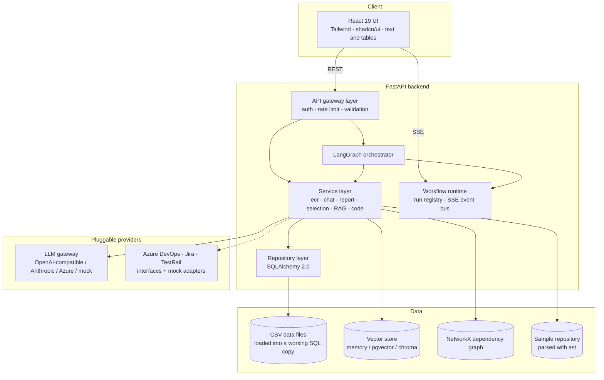
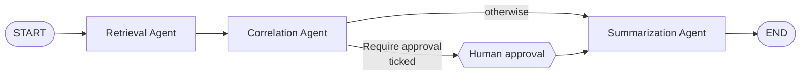
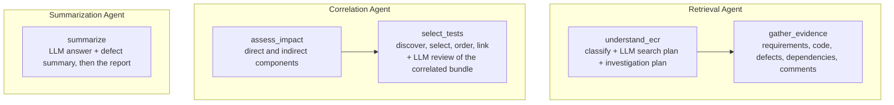
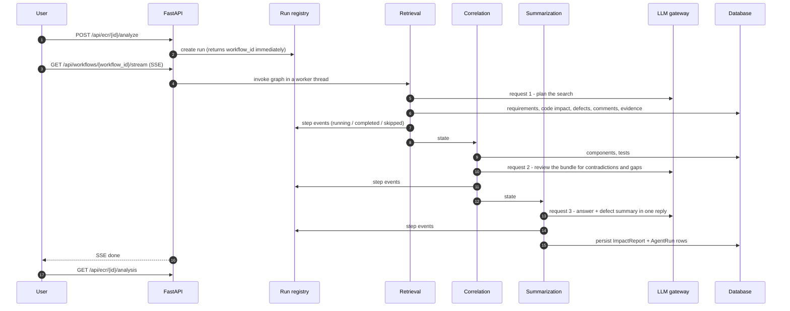
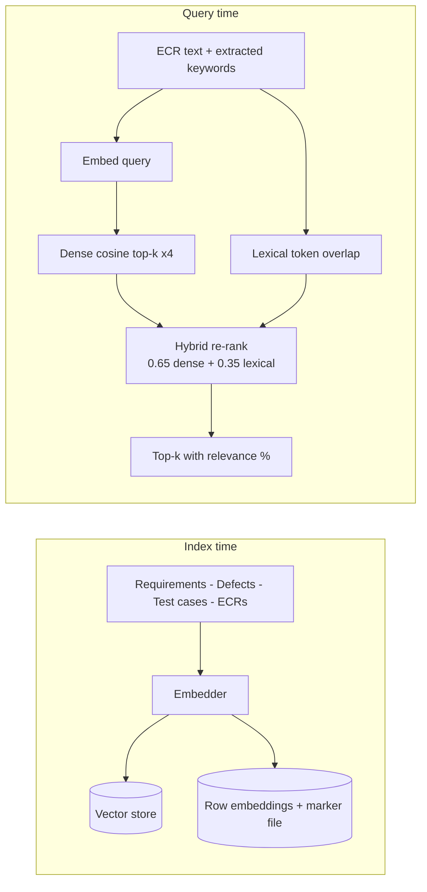
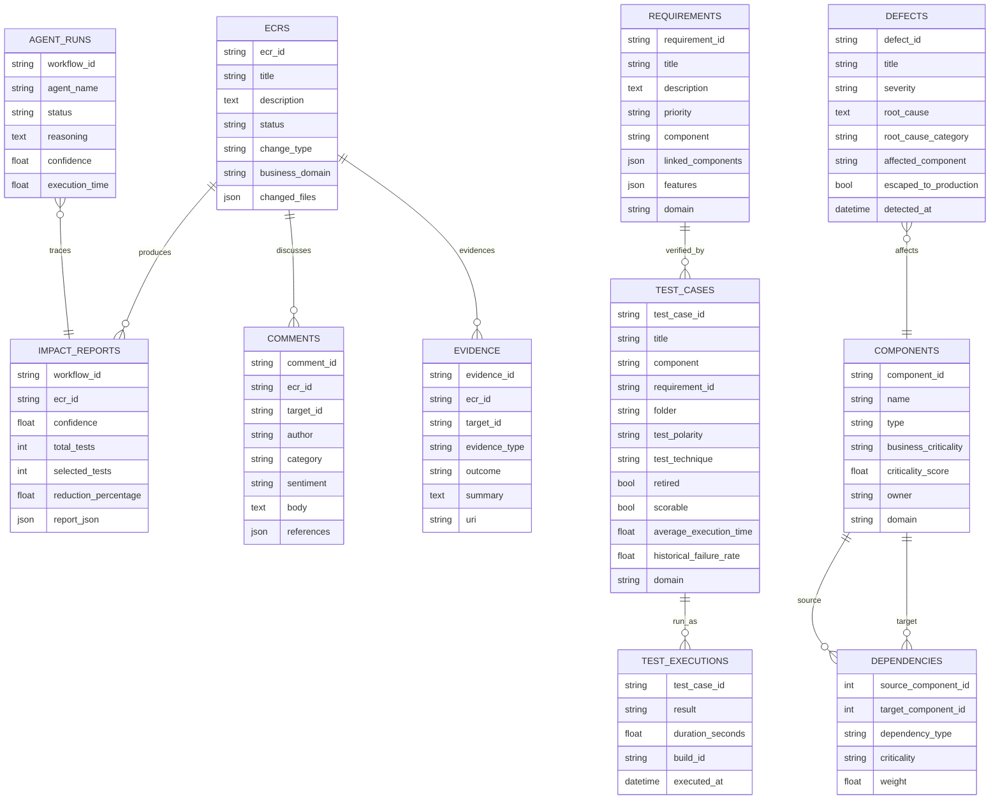

# Architecture

## 1. System architecture



### Layering rules

* **Routes** validate and translate; they contain no analysis logic.
* **Services** own the algorithms (test selection, RAG, code analysis, reports).
* **Repositories** are the only place that issues queries for an aggregate.
* **Agents** orchestrate services and tools; they never touch SQL directly except
  through repositories inside a `session_scope()`.
* **Providers** (LLM, vector store, graph, requirement sources) sit behind
  interfaces so an implementation swap is a constructor change.

## 2. Agent architecture



Inside the agents:



The planning part of `understand_ecr` decides whether `gather_evidence` collects similar defects and dependencies.
Skipping is recorded, surfaced in the UI and folded into the confidence score -
a skipped step is a decision, not a silent omission.

Each agent makes **exactly one LLM request**: Retrieval plans what to search for,
Correlation reviews the correlated bundle for contradictions and gaps,
Summarization writes the answer and the defect summary in a single reply. Three
requests per analysis - see section 10. Every prompt lives in `app/prompts.py`.

## 3. Shared state

```python
class ECRWorkflowState(TypedDict, total=False):
    workflow_id: str
    ecr_id: str
    ecr_input: dict
    options: dict

    ecr_analysis: dict
    retrieval_plan: dict          # the Retrieval Agent's LLM search plan
    plan: list[str]
    skipped_steps: Annotated[list[str], merge_unique]
    requirements: list[dict]
    requirement_analysis: dict
    defects: list[dict]
    defect_analysis: dict
    comments: list[dict]
    evidence: list[dict]
    collaboration_analysis: dict
    code_impact: dict
    dependency_analysis: dict
    impact_analysis: dict
    discovered_tests: list[dict]
    test_discovery: dict
    selected_tests: list[dict]
    test_selection: dict
    prioritized_tests: list[dict]
    test_prioritization: dict
    correlation: dict
    correlation_review: dict      # contradictions, gaps and key links
    defect_insights: dict
    defect_summary: str
    approval: dict
    final_answer: str
    answer_citations: list[str]
    final_report: dict

    execution_trace: Annotated[list[dict], operator.add]
    errors: Annotated[list[dict], operator.add]
    step_confidence: Annotated[dict[str, float], merge_dicts]
    tools_used: Annotated[dict[str, Any], merge_dicts]
```

Every agent output is a validated Pydantic model serialised to a dict - no
unstructured text is ever passed between steps. Additive keys carry reducers so
concurrent writers cannot clobber each other.

## 4. Data flow for one analysis



The run registry is an in-process, lock-guarded, append-only event list. The SSE
endpoint tails it, which keeps streaming free of cross-thread asyncio hand-offs -
LangGraph nodes run in worker threads.

## 5. RAG architecture



Three details that matter in an enterprise corpus:

1. **Hybrid, not pure dense.** Requirements and tests are short and full of
   identifiers; lexical overlap rescues matches that embeddings alone miss.
2. **One embedder per index.** Vectors from two models are not comparable. The
   service pins the embedder for the process, and if a remote call degrades
   mid-index it re-indexes locally rather than leaving a mixed index.
3. **Local by default, cached either way.** `REMOTE_EMBEDDINGS` is off, so
   document and query vectors are hashed locally and cost no gateway requests.
   Turn it on and every distinct query is one more request on top of the three
   agent calls. Remote vectors are cached with a marker file (model + dim), so a
   restart rebuilds the index instead of re-embedding several hundred documents.

## 6. Impacted components

The Correlation Agent lists the components a change touches - no score is
computed.

* **Directly impacted**: components resolved from the changed files by the code
  analyzer (falling back to components named in the ECR, then to the components
  of its linked requirements).
* **Reached through dependencies**: components the dependency walk shows the
  change propagates to. Anything below the propagation floor (0.25) is recorded
  as weakly coupled and left out, so a copy tweak does not pull in a distant
  critical service.
* Each component carries its reasons (changed directly, hops downstream, related
  past defects, business criticality), and the step adds concrete recommended
  actions from the change's risk indicators and open review concerns.

## 7. Test selection algorithm

```
relevance = 0.30 requirement_match
          + 0.25 component_match
          + 0.15 dependency_relevance
          + 0.15 historical_failure
          + 0.15 semantic_similarity     -> 0..100
```

Bands: >=90 P0, >=75 P1, >=50 P2, else P3. Tests below
`TEST_SELECTION_THRESHOLD` (default 60) are dropped; `MAX_SELECTED_TESTS` is a
safety valve, not the decider. The baseline is scoped to the ECR's own product
domain, so a payments change is never measured against the rail suite.

Prioritisation sorts by band, then component criticality, then relevance, then
*shortest* runtime - so inside a band the fastest failure signal comes first.

## 8. Database architecture



The same schema serves both sample domains; `domain` is the only discriminator.

### Storage: CSV files

Each table above is one CSV file in `backend/data/` (`DATA_DIR`). Those files are
the only place data is stored.

| File | Rows | Written by |
|---|---|---|
| `ecrs.csv` | 45 | sample data, new ECRs from the API |
| `requirements.csv` | 64 | sample data |
| `test_cases.csv` | 251 | sample data |
| `test_executions.csv` | 2,510 | sample data (10 runs per test) |
| `defects.csv` | 68 | sample data |
| `components.csv` / `dependencies.csv` | 55 / 72 | sample data |
| `comments.csv` / `evidence.csv` | 55 / 46 | sample data |
| `impact_reports.csv`, `agent_runs.csv`, `feedback.csv` | grows | the app, after every analysis |

* **Format.** The header row is the column names. Lists and objects are JSON text,
  booleans are `true`/`false`, times are ISO-8601. An empty cell takes the model
  default. `dependencies.csv` names components by `component_id`.
* **Reports.** A full report is too large for a cell, so `impact_reports.csv`
  holds a path and the JSON lives in `data/reports/<workflow_id>.json`.
* **Runtime.** At startup `init_db()` loads the files into a working SQL copy (a
  temporary SQLite file, rebuilt every start), so queries stay ordinary
  SQLAlchemy. Each committed change is written back to its table's CSV by a
  background writer (coalesced, written to a temp file then swapped in).
* **Editing.** Edit the files with the backend stopped, or restart it afterwards.
  `python -m app.seed` checks that they load and names the file, line and column
  of any bad value.
* **Embeddings** are not data: they are cached in `backend/.cache/embeddings.json`
  keyed by a hash of each row's text, so only changed rows are re-embedded.

## 9. Failure and degradation

| Failure | Behaviour |
|---|---|
| LLM key missing | Mock provider: deterministic engines + rule-based narrative. |
| LLM endpoint unreachable | The first agent call fails and falls back to its rules; the circuit opens after 3 consecutive failures. There is no startup probe - it would spend a request on every boot. |
| LLM call times out | Not retried: the gateway may already have processed (and billed) it. The agent keeps its rule-based output. Only a 429 or a failed connection is retried. |
| LLM reply is not valid JSON (truncated, for example) | The structured parse fails, the agent keeps its deterministic result and the run continues. |
| LLM fails mid-run | Circuit breaker after 3 consecutive failures; each call falls back to its deterministic baseline. |
| Remote embeddings throttled | Retry with backoff, then pin the local embedder and re-index for consistency. |
| Optional step raises | Error recorded, evidence marked unavailable, confidence penalised, workflow continues. |
| Critical step raises | Workflow fails cleanly; the run records the error and the SSE stream closes with `FAILED`. |
| Vector store unavailable | Factory falls back to the in-memory store. |

## 10. LLM usage

One analysis makes **three gateway requests, one per agent**:

| # | Agent | Prompt | What the reply changes |
|---|---|---|---|
| 1 | Retrieval | `RETRIEVAL_SYSTEM_PROMPT` + `RETRIEVAL_TASK` | Search terms that widen the requirement and defect searches; may add the dependency walk, never skip one |
| 2 | Correlation | `CORRELATION_SYSTEM_PROMPT` + `CORRELATION_TASK` | Contradictions, gaps and key links - every identifier validated against the bundle, unknown ones dropped |
| 3 | Summarization | `ANSWER_SYSTEM_PROMPT` + `SUMMARY_STYLE` + `SUMMARY_TASK` | The cited answer and the defect summary, in one reply |

* **Every prompt lives in `app/prompts.py`.** The agents only fill placeholders in;
  `app/tests/test_services/test_prompts.py` fills each template so a renamed
  placeholder fails in the tests rather than at run time.
* **No number comes from the model.** Relevance and recurrence are computed
  by the deterministic engines; the reply explains them.
* **`LLM_NARRATION=true`** adds one request per intermediate step (about seven
  more per analysis). Off by default.
* **The chat box** ("Ask a Question") is one request per question, outside the
  analysis. It reuses `ANSWER_SYSTEM_PROMPT`.
* **`test_an_analysis_makes_exactly_three_llm_requests_one_per_agent`** fails if a
  change adds a fourth.
